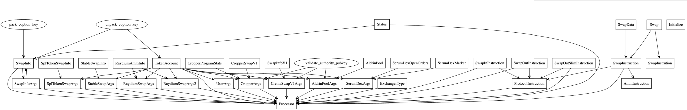

# Solana DEX 合约审计

**审计时间：06.24~07.07**

## 1、审计资料

- 【文档】：https://okg-block.larksuite.com/docx/doxuslqp8flXExvJIMGh2uqpxp8
- 【合约代码】：https://github.com/okex/dex-solana/tree/v1.0.0

## 2、审计范围

| 目录             | 文件                                     | SHA-256 哈希值                                                   |
| :--------------- | :--------------------------------------- | :--------------------------------------------------------------- |
| program-rust/src | /processor.rs                            | 5c98dafeb9403bb993ee804184b555fcbbb1cc4c1c61f8d7bf988262f6619642 |
| program-rust/src | /entrypoint.rs                           | 633729b88a7a60a8c911526293088cec6bee5050ddb7b4b8f1c3fb5a3a837d7d |
| program-rust/src | /exchanger/aldrin/mod.rs                 | 6bd82534b98aa1c36869aba31abab9f14827855c3b655166166028cc14ca81d3 |
| program-rust/src | /exchanger/aldrin/instruction.rs         | 21f7d2a4db498e89aa41d77f3a4b8f63ff9e2547d7b899afb877e1138e254b54 |
| program-rust/src | /exchanger/cropper/mod.rs                | 6bd82534b98aa1c36869aba31abab9f14827855c3b655166166028cc14ca81d3 |
| program-rust/src | /exchanger/cropper/instruction.rs        | c394708bff80868036d46a0a07f1ec36ede616b5d464035e06e8de2f449646dd |
| program-rust/src | /exchanger/serum_dex/order.rs            | c71f30a5e3a1c16a6e91186c3600c22f3903bed9a8e8891dc672f95245aa5ea8 |
| program-rust/src | /exchanger/serum_dex/mod.rs              | 16537ddb03da43e8ea71f2410f6575bb5bc2c82de50598334f787694cc8545a8 |
| program-rust/src | /exchanger/serum_dex/state.rs            | f6f957c3ca98ccad49cb3a776b4044bdf360a9c132a1a38b23b397fec71e9236 |
| program-rust/src | /exchanger/serum_dex/instruction.rs      | da02ad7bc642560f7ec17a989242fc926cbcdd2319bf7519fcd3af066a29e6d1 |
| program-rust/src | /exchanger/serum_dex/matching.rs         | 8422e476da79230b4bae76b5153482626188cb3c330b287fdfe2a1a76358ae07 |
| program-rust/src | /exchanger/stable_swap/mod.rs            | 6bd82534b98aa1c36869aba31abab9f14827855c3b655166166028cc14ca81d3 |
| program-rust/src | /exchanger/stable_swap/instruction.rs    | 261b717c4b58777ed6f7e9399d4b638e7c1e88a31ea3c5129ad62b092ebed9dd |
| program-rust/src | /exchanger/mod.rs                        | 2267faf100b3b304135d3d4065a8fbe079931eb84bb8350db2e9a48d6d37c9ff |
| program-rust/src | /exchanger/crema/mod.rs                  | 6bd82534b98aa1c36869aba31abab9f14827855c3b655166166028cc14ca81d3 |
| program-rust/src | /exchanger/crema/instruction.rs          | bd5a57437f1b799f4539e1f52494aa16a51a0f2b14bb96c8227a886ff70585f4 |
| program-rust/src | /exchanger/raydium/mod.rs                | 6bd82534b98aa1c36869aba31abab9f14827855c3b655166166028cc14ca81d3 |
| program-rust/src | /exchanger/raydium/instruction.rs        | 8b369a15e661dfb619a0d08943491f6297241a10bd46f7af54102c91c7a05d83 |
| program-rust/src | /exchanger/spl_token_swap/mod.rs         | 6bd82534b98aa1c36869aba31abab9f14827855c3b655166166028cc14ca81d3 |
| program-rust/src | /exchanger/spl_token_swap/instruction.rs | 36d6401b5bd0ef675453e1d7a63cc901a255a53e2e46596c7114d1e01645a89e |
| program-rust/src | /spl_token/error.rs                      | 01ba4719c80b6fe911b091a7c05124b64eeece964e09c058ef8f9805daca546b |
| program-rust/src | /spl_token/mod.rs                        | 615d6944d9e5cdf6a7c37b6829fb879f3dd73ab8517db34b81e0318b79e77544 |
| program-rust/src | /spl_token/instruction.rs                | f7d621328305c48e5ce5a96084f2228e57120de6a96a7d1a6ecfc82941c21467 |
| program-rust/src | /error.rs                                | 8e9fb29123019ee1809329b3ca1ece71ca31bff737e8e5cd6bb64e3c4308a10c |
| program-rust/src | /lib.rs                                  | 511024c0cfcb2198d1610bd8413367b91c44d6735f70347513f4c535fdad6a0c |
| program-rust/src | /parser/serum_dex.rs                     | 0b521e4447c90ec55b1efc7420934800d15f316380741bc1de3287d216374319 |
| program-rust/src | /parser/cropper.rs                       | d58e60db2b5df7025679bedd522377e06ea294234d9523005658a83a01fbc39d |
| program-rust/src | /parser/raydium.rs                       | 68acc1f332e98acd62a2aca86bd24cd78154e02d483f4e42541720c3afad49f4 |
| program-rust/src | /parser/spl_token_swap.rs                | bafc73679b1892553531517dc0e85a0fe1f7698e06b6b08aa3df0acd3b891f82 |
| program-rust/src | /parser/base.rs                          | bb54e7aa7bb9e4e2b72245e5fa4aaae28c0e1961ea486bdb2424447ac703cd01 |
| program-rust/src | /parser/mod.rs                           | fbfe3b42e101f874532095b8f86ccb52999700d77c5282aa797e315ed0469632 |
| program-rust/src | /parser/crema.rs                         | 57f98e552f3d96980227cc988128fef5c5d0a7fc127341eb6867cc33c2dfdb7d |
| program-rust/src | /parser/aldrin.rs                        | c6a5183e98994381609f3762a7eee6579d5e1b24cc6fc57713fd8e0b9e82eea5 |
| program-rust/src | /parser/stable_swap.rs                   | 067c9739e5f0b3143fe221cabb74753142e821724704a7c33d5e324ef104726e |
| program-rust/src | /state.rs                                | 0f130fcdcc6cad5dfb79f98917efd7d8bfad8df72aa0a42e5fd5c44d3922622d |
| program-rust/src | /instruction.rs                          | 5ca0c031cbb82107b5407465dd83b4ee0337be03ce550231a97ff284bf68a1a3 |

## 2、审计目的

本次审计的目的是为了审阅自研 Dex-Solana 项目基于 Rust 语言编写的 DEX 交易聚合器功能，研究其设计、架构，发现潜在的安全隐患，并试图找到可能存在的漏洞。

## 3、审计方式

通过清晰地理解该项目的设计目的、运行原理和实现方式，审计团队对合约代码进行了深入的研究和分析。在厘清各个合约及其函数的调用关系的基础上，对合约可能存在的漏洞进行了定位及分析。最终产生问题描述和给出相应的修改意见。
审计方法

| Static analysis | Manual Review |
| :-------------- | :------------ |

## 4、项目概述

Dex-Solana 主要实现了交易聚合器兑换功能，接入适配了不同的 DEX，通过后端询价系统，寻找市场上最优的报价路径，然后将最优路径组装成交易发送给合约执行。

## 5、文件描述

```Shell
program-rust/src
├── entrypoint.rs #指令入口
├── error.rs #业务逻辑错误定义
├── exchanger
│   ├── aldrin #aldrin 交易所适配器
│   │   ├── instruction.rs
│   │   └── mod.rs
│   ├── crema #crema 交易所适配器
│   │   ├── instruction.rs
│   │   └── mod.rs
│   ├── cropper #cropper 交易所适配器
│   │   ├── instruction.rs
│   │   └── mod.rs
│   ├── mod.rs
│   ├── raydium #raydium 交易所适配器
│   │   ├── instruction.rs
│   │   └── mod.rs
│   ├── serum_dex #serum_dex 交易所适配器
│   │   ├── instruction.rs
│   │   ├── matching.rs
│   │   ├── mod.rs
│   │   ├── order.rs
│   │   └── state.rs
│   ├── spl_token_swap #spl_token_swap 交易所适配器
│   │   ├── instruction.rs
│   │   └── mod.rs
│   └── stable_swap #stable_swap 交易所适配器
│       ├── instruction.rs
│       └── mod.rs
├── instruction.rs #指令定义
├── lib.rs #rust模块定义
├── parser
│   ├── aldrin.rs #aldrin 交易所解析模块
│   ├── base.rs
│   ├── crema.rs #crema 交易所解析模块
│   ├── cropper.rs #cropper 交易所解析模块
│   ├── mod.rs
│   ├── raydium.rs #raydium 交易所解析模块
│   ├── serum_dex.rs #serum_dex 交易所解析模块
│   ├── spl_token_swap.rs #spl_token_swap 交易所解析模块
│   └── stable_swap.rs #stable_swap 交易所解析模块
├── processor.rs #指令处理代码
├── spl_token #spl_token合约库
│   ├── error.rs
│   ├── instruction.rs
│   └── mod.rs
└── state.rs #程序状态定义
```

**UML**



## 6、审计结果

| name                     | level | status |
| :----------------------- | :---- | :----- |
| 重入                     | 无    |        |
| 注入                     | 无    |        |
| 权限绕过                 | 无    |        |
| mempool 抢跑             | 无    |        |
| 回滚                     | 无    |        |
| 条件竞争                 | 无    |        |
| 循环耗尽 gas             | 无    |        |
| 闪电贷的高影响           | 无    |        |
| 经济模型不合理           | 无    |        |
| 投票权管理混乱           | 无    |        |
| 可预见的随机数           | 无    |        |
| 数据隐私泄露             | 无    |        |
| 链上时间使用不当         | 无    |        |
| fallback 函数编码不当    | 无    |        |
| 鉴权不当                 | 无    |        |
| 内置函数使用不当         | 无    |        |
| 内联汇编使用不当         | 无    |        |
| 构造函数不规范           | 无    |        |
| 返回值不规范             | 无    |        |
| event 不规范             | 无    |        |
| 关键字使用不规范         | 无    |        |
| 未遵循 ERC 标准          | 无    |        |
| 条件判断不规范           | 无    |        |
| 流动性枯竭风险           | 无    |        |
| 中心化风险               | 无    |        |
| 逻辑变更风险             | 无    |        |
| 整数溢出                 | 无    |        |
| 函数可见性不当           | 无    |        |
| 变量初始化不当           | 无    |        |
| 合约间调用不当           | 无    |        |
| 变量不规范               | 无    |        |
| 重放                     | 无    |        |
| 随机存储位置写入         | 无    |        |
| 蜜罐逻辑                 | 无    |        |
| 哈希碰撞                 | 无    |        |
| 领奖逻辑不当             | 无    |        |
| 使用不推荐的方法         | 无    |        |
| `未遵循基本编码原则`     | `低`  |        |
| `账户缺少签名者检查`     | `中`  |        |
| 账户缺少所有者检查       | 无    |        |
| 解析账户数据前未验证账户 | 无    |        |
| 缺少相同账户校验         | 无    |        |
| 账户无法安全关闭         | 无    |        |
| 账户数据类型混淆         | 无    |        |
| `缺少账户可写检查`       | `低`  |        |
| 过时的外部依赖           | 无    |        |

## 7、审计详情

**账户缺少签名者检查 processor.rs Line361**

在关闭 `Swap_Info` 账户函数 `process_close_swap_info` 中，缺少对 `owner_account` 账户进行签名验证，存在 `Swap_Info` 账户被攻击者关闭并盗取租金的风险。

```Rust
pub fn process_close_swap_info(program_id: &Pubkey, accounts: &[AccountInfo]) -> ProgramResult {
    ...
        let swap_info = SwapInfo::unpack(&swap_info_account.data.borrow())?；

        //@OKLink Audit Description: 仅检查swap_info账户owner是否与owner_account相等，未验证owner_account账户是否已签名
        //@OKLink Audit Solution:添加owner_account签名验证

        if !Self::cmp_pubkeys(&swap_info.owner, owner_account.key) {
            return Err(ProtocolError::InvalidOwner.into());
        }
        let dest_starting_lamports = destination_account.lamports();
        **destination_account.lamports.borrow_mut() = dest_starting_lamports
            .checked_add(swap_info_account.lamports())
            .ok_or(ProtocolError::Overflow)?;
        **swap_info_account.lamports.borrow_mut() = 0;
        sol_memset(*swap_info_account.data.borrow_mut(), 0, SwapInfo::LEN);
        Ok(())
   }
```

**缺少账户可写检查 processor.rs Line547**

在构建单次兑换传入条件函数 `process_single_step_swap_in` 中，缺少对 `swap_info_args.swap_info_acc` 账户可写检查，传入不可写的 `swap_info_args.swap_info_acc` 账户会导致交易失败。

```Rust
    pub fn process_single_step_swap_in(
        program_id: &Pubkey,
        data: &SwapInInstruction,
        accounts: &[AccountInfo],
        exchanger: ExchangerType,
    ) -> ProgramResult {
    ...
        user_args
        .token_source_account
        .check_owner(user_args.source_account_owner.key, false)?;

        //@OKLink Audit Description:缺少对swap_info_args.swap_info_acc账户可写检查
        //@OKLink Audit Solution: 添加对swap_info_args.swap_info_acc账户可写检查

        match swap_info_args.swap_info.token_account {
            COption::Some(k) => {
                if k != *user_args.token_destination_account.pubkey() {
                    return Err(ProtocolError::InvalidTokenAccount.into());
                }
            }
            COption::None => {
                return Err(ProtocolError::InvalidTokenAccount.into());
            }
        };
    ...
    }
```

**未遵循基本编码原则 processor.rs Line668**

在构建单次兑换传入条件函数 `process_single_step_swap_in` 中，缺少对 `to_amount` 是否为零的检测。当 `to_amount` 值为零时，代表目标交易失败，未做检测则没有输出交易失败信息。

```Rust
pub fn process_single_step_swap_in(
        program_id: &Pubkey,
        data: &SwapInInstruction,
        accounts: &[AccountInfo],
        exchanger: ExchangerType,
    ) -> ProgramResult {
    ...
        let from_amount_changed = from_amount_before.checked_sub(from_amount_after).unwrap();
        let to_amount = to_amount_after.checked_sub(to_amount_before).unwrap();
        msg!("from_amount changed: {}", from_amount_changed);
        msg!("to_amount: {}", to_amount);

        //@OKLink Audit Description:缺少对to_amount是否为零的检查
        //@OKLink Audit Solution: 添加对对to_amount是否为零的检查

        let mut swap_info = swap_info_args.swap_info;
        swap_info.token_latest_amount = to_amount;
        SwapInfo::pack(
            swap_info,
            &mut swap_info_args.swap_info_acc.data.borrow_mut(),
        )?;
    ...
}
```

**程序逻辑缺陷 processor.rs Line703**

在 `process_single_step_swap_middle` 方法中，缺少对 `token_destination_account` 目标账户的 `owner` 进行检查, 在特殊情况通过多笔交易实现多跳过程中，可能会因为前后输入不一致导致交易失败。

```Rust
pub fn process_single_step_swap_middle(
        program_id: &Pubkey,
        accounts: &[AccountInfo],
        exchanger: ExchangerType,
    ) -> ProgramResult {
        ...

        if !user_args.source_account_owner.is_signer {
            return Err(ProtocolError::InvalidSignerAccount.into());
        }
        user_args
            .token_source_account
            .check_owner(user_args.source_account_owner.key, false)?;

        //@OKLink Audit Description:缺少对 token_destination_account 账户 owner 的检查
        //@OKLink Audit Solution: 添加对 token_destination_account 账户owner 的检查

        if !swap_info_args.swap_info_acc.is_writable {
            return Err(ProtocolError::ReadonlyAccount.into());
        }

        ...
    }
```

**未遵循基本编码原则 processor.rs Line896, 900, 1001**

在 `process_single_step_swap_out` 方法中，`expect_amount_out` 参数没有参与程序运算。与`process_single_step_swap_out_slim` 方法没有实际区别。

```Rust
pub fn process_single_step_swap_out(
        program_id: &Pubkey,
        data: &SwapOutInstruction,
        accounts: &[AccountInfo],
        exchanger: ExchangerType,
    ) -> ProgramResult {
        ...

        //@OKLink Audit Description: expect_amount_out 变量没有被真正使用
        //@OKLink Audit Solution: 检查该变量使用场景，是否为冗余变量

        msg!(
            "from_amount_before: {}, to_amount_before: {}, amount_in: {}, expect_amount_out: {}, minimum_amount_out: {}",
            from_amount_before,
            to_amount_before,
            amount_in,
            data.expect_amount_out,
            data.minimum_amount_out,
        );

        ...

        msg!(
            "to_amount: {}, expect: {}, minimum: {}",
            to_amount,
            data.expect_amount_out,
            data.minimum_amount_out,
        );

        ...
    }
```

**程序逻辑缺陷 processor.rs Line832**

在 `process_single_step_swap_middle` 方法中，没有对 `to_amount` 进行滑点限制检查，以防止在多跳过程中因滑点损耗而交易失败。

```Rust
pub fn process_single_step_swap_middle(
        program_id: &Pubkey,
        accounts: &[AccountInfo],
        exchanger: ExchangerType,
    ) -> ProgramResult {
    ...
    msg!("from_amount changed: {}", from_amount_changed);
    msg!("to_amount: {},", to_amount);
    if to_amount == 0 {
        return Err(ProtocolError::DexSwapError.into());
    }

    //@OKLink Audit Description:缺少对 to_amount 进行检查，可能超出滑点限制
    //@OKLink Audit Solution: 对 to_amount 进行滑点检查

    let mut swap_info = swap_info_args.swap_info;
    ...
}
```
